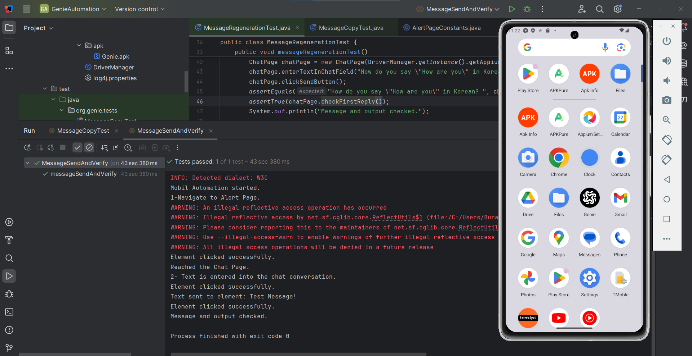
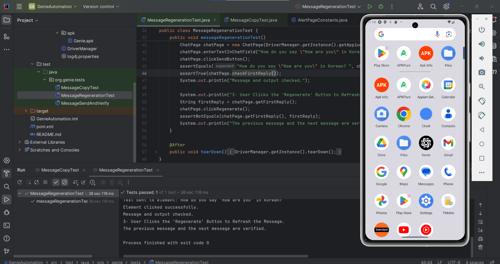
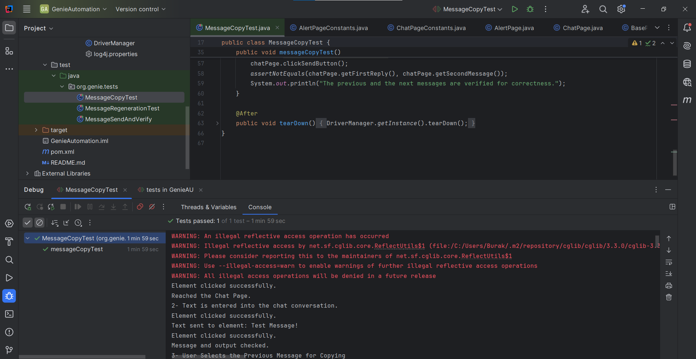

# Genie Mobile UI Test Project

The code has been developed in accordance with universally accepted software standards.  
1- Prevent overengineering  
2- Clean code(**S.O.L.I.D, YAGNI, KISS, DRY**)  
3- OOP design principles and OOP  design patterns(**Lazy Singleton**)   
4- Clean architecture(**reusability, easy to maintenance, easy to deploy**)  

The Java programming language was implemented with careful attention to adhering to the naming conventions(CamelCase).

## Results

 
 
 
